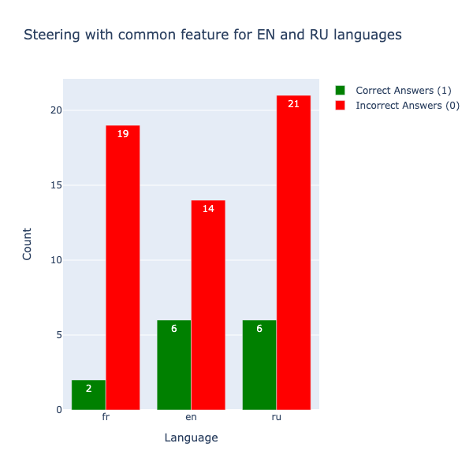
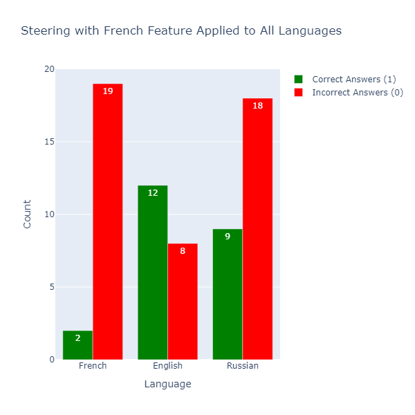

# **Math Speaks All Languages: Universal Steering Features for Multilingual Accuracy**

This project explores the use of **universal steering features** to enhance the performance of Large Language Models (LLMs) on mathematical problem-solving tasks across multiple languages. By leveraging **Goodfire API** and **latent feature steering**, we demonstrate significant improvements in accuracy without additional model training.

---

## **Overview**

Large Language Models (LLMs) often struggle with mathematical reasoning, especially in multilingual settings. Our research investigates **universal latent features** that can steer model behavior, improving performance across English, Russian, and French datasets. These universal features allow for **language-agnostic problem-solving** and contribute to more interpretable and inclusive AI systems.

---

## **Project Features**

- **Experimentation on Multilingual Mathematical Tasks**:
  - Evaluation of model performance across English, Russian, and French datasets using Goodfire API.
  - Analysis of **latent features** extracted from correct and incorrect model outputs.
- **Steering Feature Discovery**:
  - Identification of **shared latent features** that universally improve model accuracy.
- **Transferability Studies**:
  - Exploration of feature transfer across languages and datasets.

---

## **Dataset and Code**

### **Dataset**
Our dataset for multilingual mathematical problem-solving is available on [Hugging Face](https://huggingface.co/datasets/Maksim-KOS/ai_interpretability_hack).

### **Code Repository**
- **Feature Discovery and Steering**: Implemented using **Goodfire API** for latent feature extraction and steering.
- **Translation and Preprocessing**: Utilized **Mistral API** and **Google Translate** for dataset generation.
- **Visualization**: Includes scripts for analyzing and visualizing results.

---

## **How to Use**

1. Clone the repository:
   ```bash
   git clone https://github.com/MaksimKoster/goodfire_ai_hack.git
   cd goodfire_ai_hack
   ```

2. Run experiments:
   - **Dataset creation**: `dataset_creation.ipynb`
   - **Visualization**: `vis_results.ipynb` and `vis_results_mix_french.ipynb`

3. Explore steering experiments with `work_with_api.ipynb`.

---

## **Key Visualizations**

### **Performance Comparison**
- **Baseline vs. Steering Results**:
  

### **Feature Transfer Across Languages**
- **Shared Features Impact**:
  

---

## **Future Directions**

1. Scaling experiments to larger models (e.g., Meta-Llama-3.1-70B).
2. Extending benchmarks to additional languages, such as Arabic and Japanese.
3. Investigating robustness against adversarial tasks and noisy inputs.
4. Exploring applications in symbolic reasoning and proof validation.

---

## **Citation**

If you use this research or dataset, please cite our work:
```
@misc{kostritsya2024mathspeaks,
  title={Math Speaks All Languages: Universal Steering Features for Multilingual Accuracy},
  author={Maksim Kostritsya and others},
  year={2024},
  url={https://github.com/MaksimKoster/goodfire_ai_hack.git}
}
```
